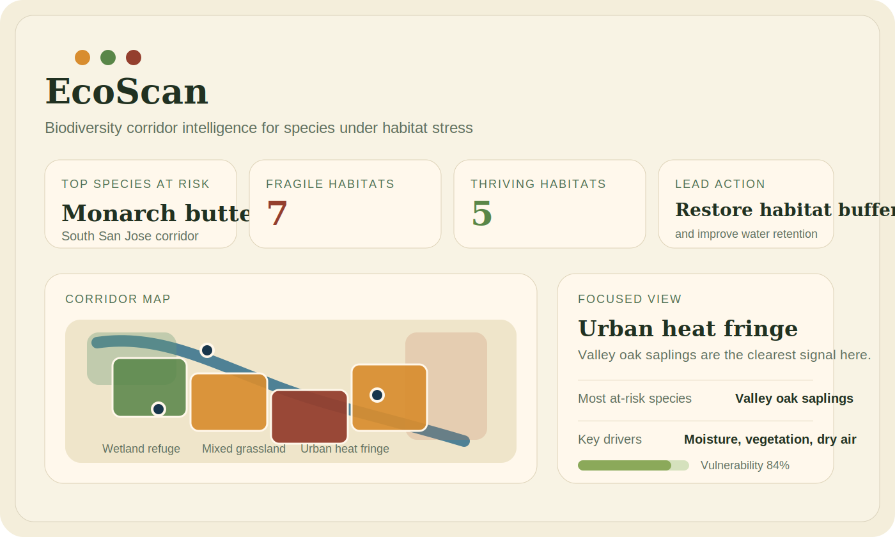

# EcoScan

EcoScan is a biodiversity health dashboard that combines habitat cells, environmental sensor context, and species-specific habitat rules to show which plants and animals are under stress first.

The current demo is centered on the real Coyote Valley and Coyote Creek corridor in South San Jose, California.

- `./run.sh` starts everything locally
- the website now follows one guided demo path instead of a dense multi-tab dashboard
- the sample data is tied to real places and public conservation references
- you can swap in your own `CSV` and `JSON` files without editing the code

## What EcoScan Does

EcoScan loads habitat and sensor data, fuses them into per-zone stress signals, and translates those signals into species pressure.

For each habitat polygon, EcoScan:

1. Reads satellite-style habitat features such as `ndvi`, `surface_temp_c`, `moisture_index`, and `elevation_m`
2. Reads nearby sensor values such as `pm25`, `humidity`, `soil_moisture`, and `water_ph`
3. Computes stress indicators like vegetation stress, moisture stress, thermal stress, and water-quality stress
4. Scores each habitat as `thriving`, `stressed`, or `fragile`
5. Estimates which species and plants are most likely to be suffering in that habitat
6. Displays the results in a local web app with one clear flow: upload, analyze, and act

## Current Demo Story

The default demo focuses on species that make a convincing biodiversity story for Coyote Valley:

- Monarch butterfly
- California red-legged frog
- Western pond turtle
- Acorn woodpecker
- Valley oak saplings
- California milkweed
- Black phoebe
- Coyote brush

The map centers on real Coyote Valley coordinates, and the sample file metadata points to public sources for:

- Coyote Creek Outdoor Classroom and regional water context
- Coyote Valley landscape and wildlife linkage context
- official species habitat guidance for monarchs and California red-legged frogs

Important note:

- the sample location, landmarks, and source references are real
- the sample species logic is based on public habitat guidance
- the sample numeric sensor values are representative, normalized demo inputs designed for local testing and hackathon presentation

That means the project is honest and easy to demo: it is a source-backed prototype, not a claim of live regulatory monitoring.

## Quick Start

From the project root:

```bash
./run.sh
```

`run.sh` will:

- start the local EcoScan server
- use the source-backed sample files in `data/sample_inputs/`
- create a PID file so you can stop the demo cleanly from another terminal
- open the dashboard automatically on macOS

Then open:

```text
http://127.0.0.1:8000
```

To stop the app from another terminal:

```bash
./stop.sh
```

Best live-demo flow:

1. Click `Use guided demo` for the safest walkthrough.
2. Optionally upload one to three close-up field photos.
3. Start your explanation from the main takeaway card.
4. Use the map and 3D scan as supporting evidence, not the first thing judges have to decode.

If you want to run manually:

```bash
PYTHONPATH=src python3 -m ecoscan.cli serve --data-dir data/sample_inputs
```

## Sample Screenshot



## Raw Output

To inspect the modeled output in the terminal:

```bash
PYTHONPATH=src python3 -m ecoscan.cli demo --data-dir data/sample_inputs
```

This prints:

- study area metadata
- biodiversity overview
- species catalog rollup
- most fragile habitat
- habitat-level recommendations

## Project Structure

```text
EcoScan/
├── run.sh
├── stop.sh
├── data/
│   └── sample_inputs/
│       ├── habitats.csv
│       ├── sensors.csv
│       └── map.json
├── docs/
│   └── sample-dashboard.svg
├── src/
│   └── ecoscan/
│       ├── api.py
│       ├── cli.py
│       ├── dataio.py
│       ├── demo.py
│       ├── fusion.py
│       ├── models.py
│       ├── pipeline.py
│       ├── server.py
│       └── static/
└── tests/
```

## Input Files

EcoScan accepts three file types.

### `habitats.csv`

Required columns:

```text
cell_id,centroid_lon,centroid_lat,ndvi,surface_temp_c,moisture_index,elevation_m
```

What these mean:

- `cell_id`: unique polygon or grid-cell ID
- `centroid_lon` and `centroid_lat`: the location of the habitat cell
- `ndvi`: vegetation greenness index from satellite or raster analysis
- `surface_temp_c`: land-surface temperature in Celsius
- `moisture_index`: normalized moisture indicator
- `elevation_m`: elevation in meters

### `sensors.csv`

Required columns:

```text
sensor_id,lon,lat,pm25,humidity,soil_moisture,water_ph
```

What these mean:

- `sensor_id`: station ID used across the app
- `lon` and `lat`: station coordinates
- `pm25`: air quality value
- `humidity`: relative humidity
- `soil_moisture`: normalized soil moisture
- `water_ph`: water chemistry context

### `map.json`

`map.json` controls the story layer and map layer. At minimum, it should contain:

- `study_area`
- `cell_polygons`

Recommended fields for the best experience:

- `landmarks`
- `system_snapshot`
- `location_context`
- `sensor_profiles`
- `data_sources`

The current sample file shows the full recommended structure.

## Use Your Own Data

Point EcoScan at your own folder:

```bash
PYTHONPATH=src python3 -m ecoscan.cli serve --data-dir /path/to/my-inputs
```

Or pass the files one-by-one:

```bash
PYTHONPATH=src python3 -m ecoscan.cli demo \
  --cells-file /path/to/habitats.csv \
  --sensors-file /path/to/sensors.csv \
  --map-file /path/to/map.json
```

You can also pass options through the launcher:

```bash
./run.sh --port 8123
```

## How To Implement Real Data

The easiest way to move from demo data to real data is to keep EcoScan's file schema and build small export steps from your actual sources.

### Recommended Real Data Workflow

1. Export or derive habitat cells from satellite or GIS data
2. Export real station readings from your sensor platform or public API
3. Convert both into `habitats.csv` and `sensors.csv`
4. Build a matching `map.json` with real polygons and source notes
5. Run EcoScan locally against that folder

### Good Real Data Sources For This Project

Habitat and land cover:

- Sentinel-2 vegetation indices
- Landsat land-surface temperature
- local `GeoTIFF`, `CSV`, or GIS exports
- `GeoJSON` polygons converted into the `cell_polygons` format

Sensors and field measurements:

- NOAA weather observations
- USGS water and groundwater stations
- EPA or regional air-quality monitors
- your own IoT CSV exports

Species context:

- state wildlife agencies
- U.S. Fish and Wildlife Service species pages
- local conservation or open-space agencies

### Practical Conversion Pattern

If your real data starts in tools like QGIS, Google Earth Engine, ArcGIS, or a notebook pipeline:

- generate one row per habitat unit in `habitats.csv`
- generate one row per station in `sensors.csv`
- export the habitat polygons into `map.json`
- include source URLs and notes in `map.json` so the website can explain where the data came from

### Suggested Real-Data Additions

If you want to take this farther after the hackathon:

1. add a small ingestion script that converts `GeoJSON` or `GeoTIFF` outputs into EcoScan CSVs
2. add a periodic fetch from NOAA, USGS, or your own sensor API
3. add species-specific rules for your exact ecosystem instead of the current Coyote Valley demo species set

## Website Experience

The current UI is intentionally optimized for a live hackathon walkthrough:

- `Hero`: what EcoScan does and why this corridor matters
- `Intake`: one recommended path, with optional photo upload
- `Main takeaway`: the one verdict to read first
- `Evidence`: supporting photos and compact detection cards
- `Map + 3D scan`: spatial proof after the main story is already clear
- `Deep dive`: habitat, species, sensor, and source detail when a judge wants more

## Useful Commands

Start the local site:

```bash
./run.sh
```

Start it on another port:

```bash
./run.sh --port 8123
```

Print raw output:

```bash
PYTHONPATH=src python3 -m ecoscan.cli demo --data-dir data/sample_inputs
```

Run tests:

```bash
PYTHONPATH=src python3 -m unittest discover -s tests -v
```

## Troubleshooting

If the browser does not open automatically:

- keep the server running
- open `http://127.0.0.1:8000` manually

If port `8000` is already in use:

```bash
./run.sh --port 8123
```

If the map tiles do not load:

- check that your browser has internet access
- the app still runs locally, but the Leaflet base map depends on OpenStreetMap tiles

If your custom data fails to load:

- verify that `habitats.csv` and `sensors.csv` include the required columns
- verify that `map.json` contains `study_area` and `cell_polygons`

## Verification

The project can be verified with:

```bash
PYTHONPATH=src python3 -m unittest discover -s tests -v
```
